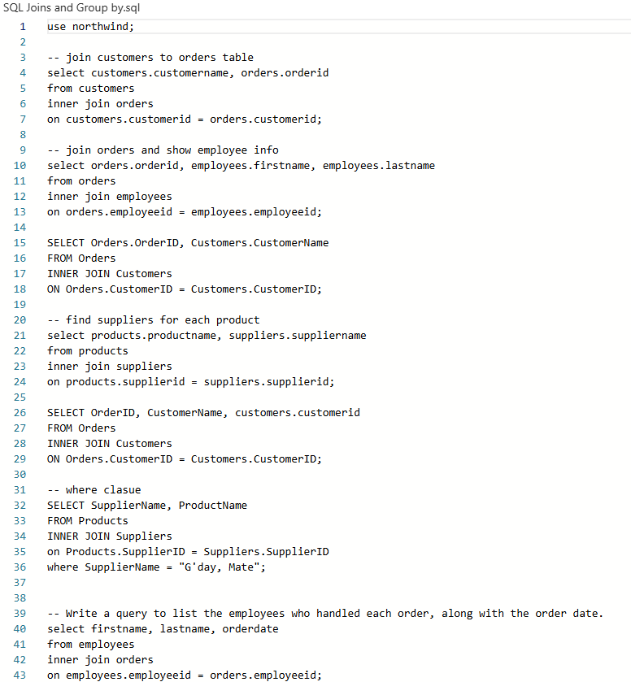

# SQL Projects – Data Technician Workbook

## 📌 Overview

This repository contains a collection of **SQL queries and exercises** completed as part of a **Data Technician training programme**. The work demonstrates practical SQL skills using real-world datasets and business scenarios.

The projects focus on data retrieval, filtering, sorting, aggregation, and table relationships using joins.

---

## 🗄️ Databases Used

* **Northwind Database**

  * Customers
  * Orders
  * Products
  * Suppliers
  * Categories
  * Employees
  * OrderDetails

* **World Database**

  * Country
  * City

---

## 🛠️ Skills Demonstrated

* Writing SQL queries using:

  * `SELECT`, `WHERE`, `ORDER BY`
  * `DISTINCT`, `BETWEEN`, `IN`, `LIKE`
  * Aggregate functions (`COUNT`, `SUM`, `AVG`)
  * `GROUP BY`
* Working with **JOINs**:

  * INNER JOIN
  * LEFT JOIN
  * RIGHT JOIN
  * FULL JOIN
  * SELF JOIN
* Filtering and analysing real-world datasets
* Answering business-driven data questions
* Using **MySQL Workbench**

* 

---

## 📊 Key Tasks & Examples

### 🔹 Data Retrieval

* Retrieve full customer and product datasets
* Filter customers by country and city
* Identify high-value and mid-range products

### 🔹 Business Analysis

* Customers targeted for marketing campaigns
* Product inventory by category
* Orders sorted by date and year
* Sales volume per product

### 🔹 Relational Analysis

* Link products to suppliers
* Classify products by category
* Combine customer, order, and employee data
* Generate supply chain overview reports

### 🔹 World Database Analysis

* Count cities by country
* Identify most and least populated cities
* Find capital cities
* Analyse population trends by country
* Filter cities by name patterns and population ranges

---

## ▶️ How to Run the Queries

1. Open **MySQL Workbench**
2. Import the required database (Northwind or World)
3. Open the `.sql` file or paste the query into a new SQL tab
4. Run the query and view results in the output panel

---

## 📂 Repository Structure

* `/northwind_queries.sql` – SQL queries using the Northwind database
* `/world_db_queries.sql` – SQL queries using the World database
* `/screenshots/` – Evidence of executed queries (if applicable)

---

## 🎓 Learning Outcome

This project strengthened my understanding of:

* Relational databases
* Writing efficient SQL queries
* Analysing business data
* Translating real-world questions into SQL solutions

---

⭐ *This repository reflects my progress in SQL and data analysis as part of my Data Technician training.*
